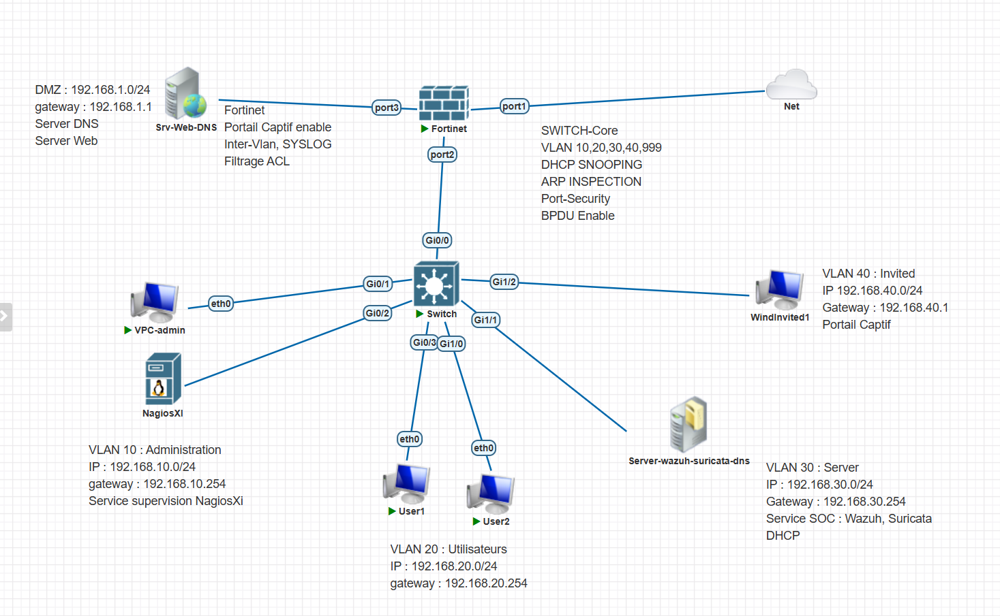

# Architecture réseau sécurisée pour une PME

> **Contexte** : projet de synthèse — Licence Professionnelle ASUR, INPTIC (module Outils de sécurité)
> **Équipe** : 4 étudiants — **ma contribution : segmentation VLAN et sécurisation de la couche 2**
> **Plateforme** : PNETLab
> **Période** : 2025-2026

[← Retour au portfolio](index.md)

---

## 1. Résumé exécutif

L'entreprise fictive SecureTech SARL (100 employés) disposait d'un réseau à plat : tous les
postes sur le même segment, visiteurs connectés au Wi-Fi interne, serveurs joignables depuis
n'importe quel poste, aucun filtrage entre services et aucune journalisation.

L'objectif était de reconstruire cette infrastructure selon les bonnes pratiques de
cybersécurité : cloisonner les usages, contrôler les flux, protéger le périmètre, isoler les
invités et rendre les événements réseau observables.

Le résultat est une architecture à quatre domaines de diffusion séparés, protégée par un
pare-feu nouvelle génération avec DMZ, dont les accès invités passent par un portail captif et
dont les événements sont centralisés dans un SIEM.

---

## 2. Cahier des charges

### Contraintes fonctionnelles

| Exigence | Traduction technique |
|---|---|
| Séparer les services | 4 VLAN distincts avec routage inter-VLAN contrôlé |
| Isoler les visiteurs | VLAN dédié, accès Internet uniquement, portail captif |
| Publier des services web | DMZ séparée du LAN, accessible depuis Internet |
| Protéger le LAN | Aucune connexion entrante depuis Internet vers le LAN |
| Tracer les événements | Centralisation Syslog, SIEM, supervision d'infrastructure |

### Plan d'adressage

| VLAN | Nom | Réseau | Passerelle | Contenu |
|---|---|---|---|---|
| 10 | Administration | 192.168.10.0/24 | 192.168.10.254 | Poste d'administration, NagiosXI |
| 20 | Utilisateurs | 192.168.20.0/24 | 192.168.20.254 | Postes de travail |
| 30 | Serveurs | 192.168.30.0/24 | 192.168.30.254 | Wazuh, Suricata, DHCP, DNS |
| 40 | Invités | 192.168.40.0/24 | 192.168.40.1 | Postes visiteurs (portail captif) |
| 999 | Natif / parking | — | — | VLAN natif des trunks, ports inutilisés |
| — | DMZ | 192.168.1.0/24 | 192.168.1.1 | Serveur Web, serveur DNS public |

> Toutes les plages sont privées (RFC 1918). Aucune adresse publique réelle n'est publiée.

### Matrice de flux

| Source | Destination | Action |
|---|---|---|
| Administration | Tous les VLAN | Autoriser |
| Utilisateurs | Serveurs (HTTP/HTTPS) | Autoriser |
| Utilisateurs | Administration | Interdire |
| Invités | LAN | Interdire |
| Invités | Internet | Autoriser (HTTP, HTTPS, DNS) |
| Serveurs | Internet | Autoriser (mises à jour uniquement) |
| Internet | Serveur Web (DMZ) | Autoriser (HTTP/HTTPS) |
| Internet | LAN | Interdire |

---

## 3. Schéma d'architecture



**Lecture du schéma.** Le FortiGate est le point de convergence : `port1` vers Internet,
`port2` en trunk 802.1Q vers le commutateur cœur (il porte le routage inter-VLAN et les ACL),
`port3` vers la DMZ. Le commutateur cœur distribue les quatre VLAN vers les postes et serveurs,
et porte l'ensemble des mécanismes de sécurité de niveau 2.

---

## 4. Procédure de déploiement

### 4.1 Segmentation VLAN *(ma contribution)*

Création des VLAN et affectation des ports d'accès :

```
! Déclaration des VLAN
vlan 10
 name ADMINISTRATION
vlan 20
 name UTILISATEURS
vlan 30
 name SERVEURS
vlan 40
 name INVITES
vlan 999
 name NATIF-PARKING

! Port d'accès — poste utilisateur
interface GigabitEthernet0/3
 description Poste utilisateur User1
 switchport mode access
 switchport access vlan 20
 spanning-tree portfast
```

Configuration du lien trunk vers le pare-feu, avec restriction explicite des VLAN autorisés :

```
interface GigabitEthernet0/0
 description Trunk vers FortiGate port2
 switchport trunk encapsulation dot1q
 switchport mode trunk
 switchport trunk native vlan 999
 switchport trunk allowed vlan 10,20,30,40
```

> **Choix de conception.** Le VLAN natif est déplacé sur un VLAN inutilisé (999) plutôt que
> laissé sur le VLAN 1 par défaut. Cela ferme la voie aux attaques de saut de VLAN par
> double étiquetage, qui exploitent précisément le fait que le trafic du VLAN natif circule
> sans étiquette sur le trunk.

Mise en parking des ports inutilisés :

```
interface range GigabitEthernet1/3 - 15
 switchport mode access
 switchport access vlan 999
 shutdown
```

### 4.2 Sécurisation de la couche 2 *(ma contribution)*

**Port-Security** — limite le nombre d'adresses MAC par port d'accès :

```
interface range GigabitEthernet0/1 - 3
 switchport port-security
 switchport port-security maximum 2
 switchport port-security violation restrict
 switchport port-security mac-address sticky
```

> **Choix de conception.** Le mode `restrict` a été retenu plutôt que `shutdown` : il bloque
> le trafic illégitime et génère une alerte SNMP/Syslog exploitable par le SIEM, sans couper
> physiquement le port. En production, un port désactivé pour une simple erreur de branchement
> génère un appel au support ; une alerte, elle, remonte l'information sans interrompre le service.

**DHCP Snooping** — protège contre les serveurs DHCP illégitimes :

```
ip dhcp snooping
ip dhcp snooping vlan 10,20,30,40
no ip dhcp snooping information option

interface GigabitEthernet0/0
 description Trunk vers le pare-feu — port de confiance
 ip dhcp snooping trust
```

Seuls les ports menant au serveur DHCP légitime sont déclarés *trusted*. Tout autre port qui
émettrait une réponse DHCP (OFFER, ACK) voit son trafic rejeté.

**Dynamic ARP Inspection** — s'appuie sur la table de DHCP Snooping pour vérifier la cohérence
des messages ARP et bloquer l'usurpation :

```
ip arp inspection vlan 10,20,30,40
ip arp inspection validate src-mac dst-mac ip

interface GigabitEthernet0/0
 ip arp inspection trust
```

**BPDU Guard** — empêche l'introduction d'un commutateur pirate sur un port d'accès :

```
spanning-tree portfast bpduguard default
```

### 4.3 Filtrage et périmètre *(travail d'équipe)*

Configuration du FortiGate : création des zones WAN, LAN, DMZ et Invités, NAT sortant,
publication du serveur Web de la DMZ par VIP, et application de la matrice de flux
sous forme de politiques de sécurité.

[À COMPLÉTER : captures des politiques FortiGate et de la configuration du portail captif.]

### 4.4 Supervision *(travail d'équipe)*

Centralisation Syslog du FortiGate et du commutateur, agents Wazuh, sondes Suricata,
supervision d'infrastructure NagiosXI.

[À COMPLÉTER : capture du tableau de bord et exemple de règle d'alerte.]

---

## 5. Recette et tests

| # | Test | Méthode | Résultat attendu | Statut |
|---|---|---|---|---|
| 1 | Isolation des VLAN | Ping VLAN 20 → VLAN 10 | Échec (bloqué par ACL) | ☐ |
| 2 | Accès autorisé | Navigation VLAN 20 → serveur Web | Succès | ☐ |
| 3 | Accès administrateur | Ping VLAN 10 → tous les VLAN | Succès | ☐ |
| 4 | Isolation des invités | Ping VLAN 40 → VLAN 20 | Échec | ☐ |
| 5 | Sortie Internet invités | Navigation VLAN 40 → Internet | Succès après authentification | ☐ |
| 6 | Publication DMZ | Accès externe → serveur Web | Succès | ☐ |
| 7 | Protection du LAN | Accès externe → LAN | Échec | ☐ |
| 8 | Port-Security | Connexion d'une 3ᵉ adresse MAC | Trafic bloqué + alerte | ☐ |
| 9 | DHCP Snooping | Serveur DHCP pirate sur port non-trusted | Offres rejetées | ☐ |
| 10 | Dynamic ARP Inspection | Tentative d'ARP spoofing | Paquets ARP rejetés | ☐ |
| 11 | Journalisation | Consultation du SIEM après les tests | Événements présents | ☐ |

[À COMPLÉTER : coche chaque test et insère la capture d'écran correspondante.]

**Exemples de commandes de vérification :**

```
show vlan brief
show interfaces trunk
show port-security interface GigabitEthernet0/1
show ip dhcp snooping binding
show ip arp inspection statistics
show spanning-tree summary
```

---

## 6. Difficultés rencontrées et enseignements

### Difficulté 1 — [À COMPLÉTER]

**Symptôme observé :** …
**Diagnostic :** …
**Résolution :** …
**Ce que j'en retiens :** …

### Difficulté 2 — [À COMPLÉTER]

**Symptôme observé :** …
**Diagnostic :** …
**Résolution :** …
**Ce que j'en retiens :** …

---

## 7. Améliorations envisagées

- Authentification 802.1X par port avec FreeRADIUS, en remplacement du filtrage par adresse MAC
- Haute disponibilité du pare-feu (cluster actif/passif)
- Chiffrement des accès d'administration par VPN dédié
- Tableau de bord Grafana adossé aux données de supervision

---

[← Retour au portfolio](index.md)
