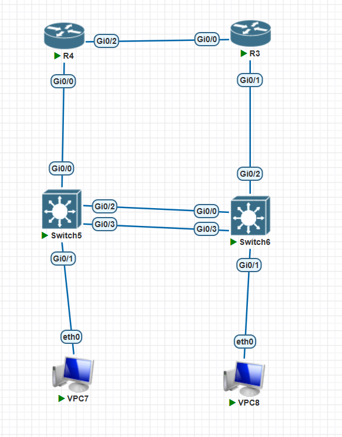

# Cœur de réseau redondant à haute disponibilité

> **Contexte** : laboratoire personnel — Licence Professionnelle ASUR, INPTIC
> **Plateforme** : PNETLab (routeurs et commutateurs Cisco IOS)
> **Période** : 2026

[← Retour au portfolio](index.md)

---

## 1. Résumé exécutif

Dans un réseau d'entreprise, la panne d'une seule passerelle suffit à couper l'accès de tout un
service. Ce laboratoire répond à une question précise : comment concevoir une infrastructure qui
continue de fonctionner malgré la perte d'un routeur ou d'un lien, sans intervention humaine et
sans reconfiguration des postes clients ?

L'architecture repose sur deux routeurs assurant conjointement le rôle de passerelle pour deux
VLAN, et sur deux commutateurs reliés par une agrégation de liens. Chaque routeur est passerelle
active pour un VLAN et passerelle de secours pour l'autre : les deux équipements travaillent en
permanence plutôt que d'en laisser un inactif, et la défaillance de l'un fait basculer
automatiquement ses VLAN vers l'autre.

---

## 2. Besoins et prérequis

### Équipements de la maquette

| Rôle | Quantité | Type d'image | Fonction assurée |
|---|---|---|---|
| Routeur (R4, R3) | 2 | Image routeur Cisco IOS | Passerelles HSRP, routage inter-VLAN |
| Commutateur (Switch5, Switch6) | 2 | Image commutateur Cisco IOS L2 | Commutation, EtherChannel, spanning-tree |
| Poste client (VPC7, VPC8) | 2 | VPCS | Génération de trafic et validation |

### Câblage requis

| Lien | Extrémité 1 | Extrémité 2 | Rôle |
|---|---|---|---|
| Inter-routeurs | R4 Gi0/2 | R3 Gi0/0 | Liaison de secours entre passerelles |
| Accès R4 | R4 Gi0/0 | Switch5 Gi0/0 | Trunk 802.1Q |
| Accès R3 | R3 Gi0/1 | Switch6 Gi0/2 | Trunk 802.1Q |
| Agrégation 1 | Switch5 Gi0/2 | Switch6 Gi0/0 | Membre du Port-channel 1 |
| Agrégation 2 | Switch5 Gi0/3 | Switch6 Gi0/3 | Membre du Port-channel 1 |
| Poste VLAN 10 | VPC7 eth0 | Switch5 Gi0/1 | Port d'accès |
| Poste VLAN 20 | VPC8 eth0 | Switch6 Gi0/1 | Port d'accès |

### Prérequis fonctionnels

- Une image routeur supportant HSRP version 2 et les sous-interfaces 802.1Q
- Une image commutateur supportant LACP et Rapid-PVST
- Ressources suffisantes sur l'hyperviseur : compter environ 512 Mo de mémoire vive par
  équipement émulé, soit environ 2 Go pour l'ensemble de la maquette

---

## 3. Cahier des charges

| Exigence | Traduction technique |
|---|---|
| Aucun point de défaillance unique sur la passerelle | HSRP v2 avec adresse virtuelle et préemption |
| Répartir la charge entre les deux routeurs | Un groupe HSRP par VLAN, rôles inversés |
| Redondance et débit entre commutateurs | EtherChannel LACP sur deux liens |
| Routage inter-VLAN sur un lien unique | Sous-interfaces 802.1Q (router-on-a-stick) |
| Convergence rapide de la couche 2 | Rapid-PVST, root bridge maîtrisé |
| Sécurisation de la couche d'accès | VLAN natif dédié, PortFast et BPDU Guard |

### Plan d'adressage

| VLAN | Nom | Réseau | Passerelle virtuelle | Poste |
|---|---|---|---|---|
| 10 | UTILISATEURS | 192.168.10.0/24 | 192.168.10.254 | VPC7 — 192.168.10.11 |
| 20 | SERVEURS | 192.168.20.0/24 | 192.168.20.254 | VPC8 — 192.168.20.11 |
| 99 | NATIF-PARKING | — | — | VLAN natif des trunks |

| Équipement | VLAN 10 | VLAN 20 | Liaison inter-routeurs |
|---|---|---|---|
| R4 | 192.168.10.252 | 192.168.20.252 | 10.10.10.1/30 |
| R3 | 192.168.10.253 | 192.168.20.253 | 10.10.10.2/30 |

### Répartition des rôles

| VLAN | HSRP actif | HSRP secours | Root bridge STP |
|---|---|---|---|
| 10 | R4 (priorité 110) | R3 | Switch5 |
| 20 | R3 (priorité 110) | R4 | Switch6 |

> **Choix de conception.** Plutôt que de désigner un routeur maître pour tout le réseau, chaque
> VLAN se voit attribuer une passerelle active différente. Les deux routeurs acheminent donc du
> trafic en permanence, ce qui évite d'immobiliser un équipement coûteux en simple attente. Le
> root bridge du spanning-tree est aligné sur le commutateur raccordé au routeur actif, afin que
> le chemin de couche 2 ne traverse pas inutilement l'agrégation inter-commutateurs.

---

## 4. Schéma d'architecture



```
     R4 ──────── Gi0/2 ══ Gi0/0 ──────── R3
   HSRP actif V10                   HSRP actif V20
      │ Gi0/0                        Gi0/1 │
      │                                    │
   Gi0/0                                Gi0/2
  [ Switch5 ] ══ Po1 — LACP (x2) ══ [ Switch6 ]
      │ Gi0/1                        Gi0/1 │
     VPC7                                VPC8
   VLAN 10                              VLAN 20
```

Chaque poste atteint sa passerelle par le chemin direct en fonctionnement nominal. En cas de
panne du routeur actif, le trafic emprunte l'agrégation entre commutateurs pour rejoindre le
routeur de secours.

---

## 5. Procédure de déploiement

### 5.1 Configuration de R4 — passerelle active du VLAN 10

```
hostname R4
!
! --- Liaison trunk vers Switch5 (router-on-a-stick) ---
interface GigabitEthernet0/0
 description Trunk 802.1Q vers Switch5
 no ip address
 no shutdown
!
interface GigabitEthernet0/0.10
 description VLAN Utilisateurs - HSRP actif
 encapsulation dot1Q 10
 ip address 192.168.10.252 255.255.255.0
 standby version 2
 standby 10 ip 192.168.10.254
 standby 10 priority 110
 standby 10 preempt
 standby 10 timers 1 3
!
interface GigabitEthernet0/0.20
 description VLAN Serveurs - HSRP secours
 encapsulation dot1Q 20
 ip address 192.168.20.252 255.255.255.0
 standby version 2
 standby 20 ip 192.168.20.254
 standby 20 preempt
 standby 20 timers 1 3
!
interface GigabitEthernet0/0.99
 description VLAN natif
 encapsulation dot1Q 99 native
!
! --- Liaison directe vers R3 ---
interface GigabitEthernet0/2
 description Liaison inter-routeurs vers R3
 ip address 10.10.10.1 255.255.255.252
 no shutdown
!
! --- Durcissement de base ---
no ip domain-lookup
service password-encryption
```

> **Choix de conception.** La préemption est activée sur les deux groupes. Sans elle, un routeur
> revenu en service après une panne resterait indéfiniment en secours : la répartition de charge
> serait perdue et les deux VLAN se retrouveraient portés par le même équipement. Les
> temporisateurs sont abaissés à 1 seconde pour les messages hello et 3 secondes pour le délai
> de bascule, contre 3 et 10 par défaut, ce qui réduit la coupure perçue par l'utilisateur.

### 5.2 Configuration de R3 — passerelle active du VLAN 20

Configuration miroir : les priorités sont inversées.

```
hostname R3
!
interface GigabitEthernet0/1
 description Trunk 802.1Q vers Switch6
 no ip address
 no shutdown
!
interface GigabitEthernet0/1.10
 description VLAN Utilisateurs - HSRP secours
 encapsulation dot1Q 10
 ip address 192.168.10.253 255.255.255.0
 standby version 2
 standby 10 ip 192.168.10.254
 standby 10 preempt
 standby 10 timers 1 3
!
interface GigabitEthernet0/1.20
 description VLAN Serveurs - HSRP actif
 encapsulation dot1Q 20
 ip address 192.168.20.253 255.255.255.0
 standby version 2
 standby 20 ip 192.168.20.254
 standby 20 priority 110
 standby 20 preempt
 standby 20 timers 1 3
!
interface GigabitEthernet0/1.99
 description VLAN natif
 encapsulation dot1Q 99 native
!
interface GigabitEthernet0/0
 description Liaison inter-routeurs vers R4
 ip address 10.10.10.2 255.255.255.252
 no shutdown
!
no ip domain-lookup
service password-encryption
```

### 5.3 Configuration de Switch5

```
hostname Switch5
!
vlan 10
 name UTILISATEURS
vlan 20
 name SERVEURS
vlan 99
 name NATIF-PARKING
!
spanning-tree mode rapid-pvst
spanning-tree vlan 10 priority 4096
spanning-tree vlan 20 priority 8192
spanning-tree portfast bpduguard default
!
! --- Trunk vers le routeur R4 ---
interface GigabitEthernet0/0
 description Trunk vers R4
 switchport trunk encapsulation dot1q
 switchport mode trunk
 switchport trunk native vlan 99
 switchport trunk allowed vlan 10,20
 no shutdown
!
! --- Agregation LACP vers Switch6 ---
interface range GigabitEthernet0/2 - 3
 description Agregation LACP vers Switch6
 switchport trunk encapsulation dot1q
 switchport mode trunk
 switchport trunk native vlan 99
 switchport trunk allowed vlan 10,20
 channel-group 1 mode active
 no shutdown
!
interface Port-channel1
 description Lien inter-commutateurs agrege
 switchport trunk encapsulation dot1q
 switchport mode trunk
 switchport trunk native vlan 99
 switchport trunk allowed vlan 10,20
!
! --- Port utilisateur ---
interface GigabitEthernet0/1
 description Poste VPC7
 switchport mode access
 switchport access vlan 10
 spanning-tree portfast
 no shutdown
!
! --- Ports inutilises ---
interface range GigabitEthernet1/0 - 3
 switchport mode access
 switchport access vlan 99
 shutdown
```

### 5.4 Configuration de Switch6

```
hostname Switch6
!
vlan 10
 name UTILISATEURS
vlan 20
 name SERVEURS
vlan 99
 name NATIF-PARKING
!
spanning-tree mode rapid-pvst
spanning-tree vlan 20 priority 4096
spanning-tree vlan 10 priority 8192
spanning-tree portfast bpduguard default
!
! --- Trunk vers le routeur R3 ---
interface GigabitEthernet0/2
 description Trunk vers R3
 switchport trunk encapsulation dot1q
 switchport mode trunk
 switchport trunk native vlan 99
 switchport trunk allowed vlan 10,20
 no shutdown
!
! --- Agregation LACP vers Switch5 ---
interface GigabitEthernet0/0
 description Agregation LACP vers Switch5
 switchport trunk encapsulation dot1q
 switchport mode trunk
 switchport trunk native vlan 99
 switchport trunk allowed vlan 10,20
 channel-group 1 mode active
 no shutdown
!
interface GigabitEthernet0/3
 description Agregation LACP vers Switch5
 switchport trunk encapsulation dot1q
 switchport mode trunk
 switchport trunk native vlan 99
 switchport trunk allowed vlan 10,20
 channel-group 1 mode active
 no shutdown
!
interface Port-channel1
 description Lien inter-commutateurs agrege
 switchport trunk encapsulation dot1q
 switchport mode trunk
 switchport trunk native vlan 99
 switchport trunk allowed vlan 10,20
!
! --- Port utilisateur ---
interface GigabitEthernet0/1
 description Poste VPC8
 switchport mode access
 switchport access vlan 20
 spanning-tree portfast
 no shutdown
!
interface range GigabitEthernet1/0 - 3
 switchport mode access
 switchport access vlan 99
 shutdown
```

### 5.5 Configuration des postes de test

Sous VPCS :

```
VPC7> ip 192.168.10.11 255.255.255.0 192.168.10.254
VPC8> ip 192.168.20.11 255.255.255.0 192.168.20.254
```

Les postes pointent vers l'**adresse virtuelle HSRP**, jamais vers l'adresse réelle d'un routeur.
C'est tout l'intérêt du protocole : le poste ignore quel équipement le sert réellement et
continue de fonctionner quand celui-ci change.

---

## 6. Recette et tests

| # | Test | Commande ou méthode | Résultat attendu |
|---|---|---|---|
| 1 | Agrégation LACP | `show etherchannel summary` | Po1 en état (SU), deux ports en (P) |
| 2 | Négociation LACP | `show lacp neighbor` | Voisin détecté sur les deux liens |
| 3 | Trunks actifs | `show interfaces trunk` | VLAN 10 et 20 autorisés, natif 99 |
| 4 | Sous-interfaces routeur | `show ip interface brief` | Sous-interfaces .10 et .20 en up/up |
| 5 | Root bridge VLAN 10 | `show spanning-tree vlan 10` | Switch5 est root |
| 6 | Root bridge VLAN 20 | `show spanning-tree vlan 20` | Switch6 est root |
| 7 | État HSRP VLAN 10 | `show standby brief` | R4 Active, R3 Standby |
| 8 | État HSRP VLAN 20 | `show standby brief` | R3 Active, R4 Standby |
| 9 | Connectivité passerelle | `ping 192.168.10.254` depuis VPC7 | Succès |
| 10 | Routage inter-VLAN | `ping 192.168.20.11` depuis VPC7 | Succès |
| 11 | **Bascule HSRP** | Ping continu puis extinction de R4 | Reprise automatique par R3 |
| 12 | Retour à l'état nominal | Redémarrage de R4 | Reprise du rôle actif par préemption |
| 13 | Résilience de l'agrégation | Coupure d'un seul lien du Port-channel | Aucune perte, Po1 reste actif |

### Le test de bascule

C'est le test central du laboratoire, celui qui démontre que la redondance est réelle et non
théorique.

1. Lancer un ping continu depuis VPC7 vers 192.168.20.11 — le trafic transite par R4
2. Éteindre R4 pendant que le ping tourne
3. Observer les demandes expirées, puis la reprise du trafic
4. Relever le **nombre exact de paquets perdus**
5. Vérifier sur R3 que `show standby brief` affiche désormais l'état *Active*

Sous VPCS, la commande de ping continu est :

```
VPC7> ping 192.168.20.11 -t
```

Le nombre de paquets perdus constitue le résultat mesuré de ce laboratoire.

---

## 7. Points de vigilance et diagnostic

Cette architecture combine quatre mécanismes qui dépendent les uns des autres : une erreur sur
l'un se manifeste souvent par un symptôme qui semble venir d'un autre. Les points ci-dessous
recensent les causes de panne les plus fréquentes, avec la démarche de diagnostic associée.

### 7.1 L'agrégation ne se forme pas

**Symptôme.** `show etherchannel summary` affiche le Port-channel en état (SD) ou les ports
membres marqués (I) pour *independent*, au lieu de (P) pour *bundled*.

**Causes possibles.** LACP exige que les deux interfaces membres soient rigoureusement
identiques : même mode (access ou trunk), même liste de VLAN autorisés, même VLAN natif, même
vitesse et même duplex. La moindre divergence empêche l'agrégation. Autre cause classique : les
deux extrémités configurées en `mode passive`, auquel cas aucune ne prend l'initiative de la
négociation — au moins l'un des deux côtés doit être en `mode active`.

**Démarche.** Comparer `show running-config interface` sur les quatre interfaces membres, puis
`show lacp neighbor` pour vérifier que le voisin est bien détecté.

### 7.2 Le poste ne joint pas sa passerelle virtuelle

**Symptôme.** Le ping vers l'adresse virtuelle échoue alors que les sous-interfaces du routeur
sont en up/up.

**Causes possibles.** La plus fréquente est une incohérence de VLAN natif entre le routeur et le
commutateur : `encapsulation dot1Q 99 native` d'un côté doit correspondre à
`switchport trunk native vlan 99` de l'autre. Vient ensuite l'oubli du `no shutdown` sur
l'interface physique du routeur — les sous-interfaces héritent de son état, et une interface
physique fermée les rend toutes inopérantes. Enfin, un VLAN absent de la liste
`switchport trunk allowed vlan` sur l'un des trunks coupe silencieusement le trafic concerné.

**Démarche.** `show interfaces trunk` sur les commutateurs, `show vlan brief` pour vérifier
l'existence des VLAN, et surveiller les messages de type *native VLAN mismatch* dans les
journaux.

### 7.3 Les deux routeurs se déclarent actifs simultanément

**Symptôme.** `show standby brief` affiche l'état *Active* sur R4 et sur R3 pour le même groupe.

**Cause.** Les deux routeurs ne se voient pas : leurs messages HSRP ne circulent pas entre eux,
faute de continuité de couche 2 sur le VLAN concerné. Chacun en déduit que son homologue est
tombé et prend le rôle actif. La conséquence est un conflit d'adresse virtuelle et un trafic
erratique.

**Démarche.** Vérifier que le VLAN est bien autorisé sur toute la chaîne de trunks, y compris
sur l'agrégation entre commutateurs, et que le Port-channel est opérationnel. Ce symptôme révèle
presque toujours un problème de couche 2, pas de configuration HSRP.

### 7.4 La bascule ne se produit pas, ou trop lentement

**Symptôme.** Après extinction du routeur actif, le ping reste bloqué bien au-delà de quelques
secondes.

**Causes possibles.** Les temporisateurs sont restés à leurs valeurs par défaut, soit 3 secondes
pour les messages hello et 10 secondes pour le délai de bascule. Autre cause : la préemption n'a
pas été configurée, ce qui n'empêche pas la bascule initiale mais interdit le retour à l'état
nominal après réparation.

**Démarche.** `show standby` affiche les temporisateurs en vigueur et le décompte avant
déclaration de panne. La commande `debug standby` permet d'observer la transition en direct.

### 7.5 Le trafic emprunte un chemin sous-optimal

**Symptôme.** L'architecture fonctionne, mais le trafic d'un VLAN traverse systématiquement
l'agrégation inter-commutateurs alors qu'une passerelle est directement accessible.

**Cause.** Le root bridge du spanning-tree n'est pas aligné sur le commutateur raccordé au
routeur HSRP actif. La couche 2 et la couche 3 prennent alors des décisions contradictoires.

**Démarche.** Croiser `show spanning-tree vlan 10` et `show standby brief` : pour chaque VLAN,
le root bridge doit se trouver du même côté que le routeur actif. C'est le point le plus souvent
négligé dans les architectures redondantes, et celui qui distingue une conception réfléchie
d'un assemblage fonctionnel mais inefficace.

---

## 8. Difficultés rencontrées

*À renseigner après réalisation du laboratoire, sur le modèle du premier case study : symptôme
observé, diagnostic mené, résolution appliquée, enseignement retenu.*

---

## 9. Améliorations envisagées

- Suivi d'interface HSRP (`standby track`) pour déclencher la bascule si la liaison montante
  tombe, et non uniquement si le routeur s'éteint
- Routage dynamique OSPF entre R4 et R3 via la liaison directe, en préparation d'une
  interconnexion vers un cœur de réseau
- Passage à VRRP pour un environnement multi-constructeurs
- Supervision SNMP des changements d'état HSRP, avec alerte à chaque bascule

---

[← Retour au portfolio](index.md)
